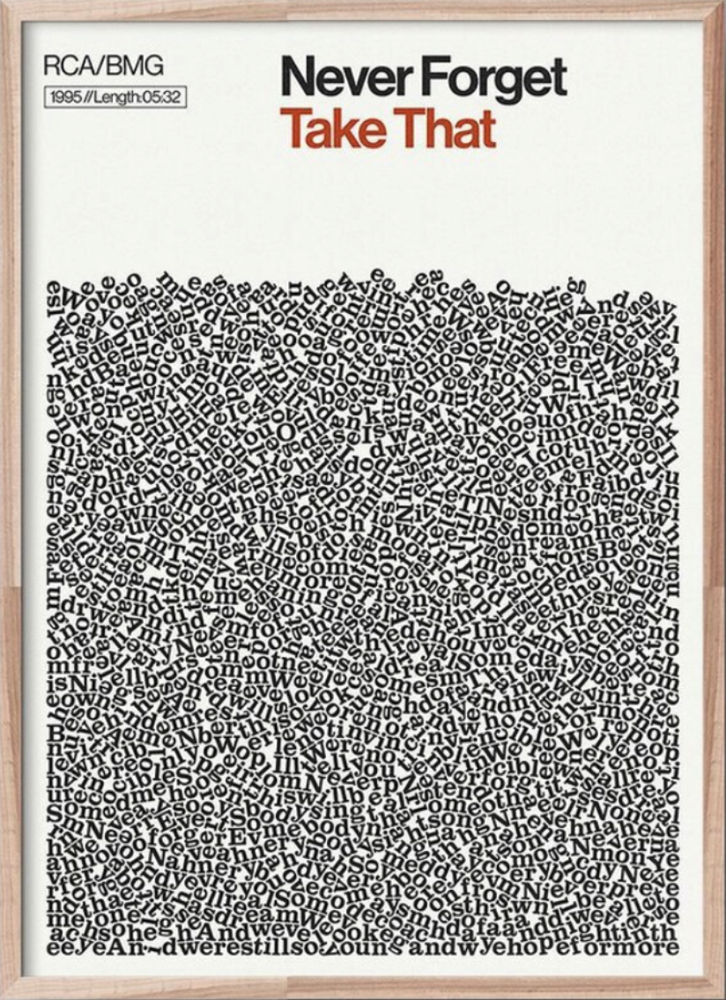

# Lyrics Ball Pit

Implements two different strategies for rendering a "lyrics ball pit". The input string can be anything but lyrics work best! 📖 🎶

## Inspiration

The idea was inspired by posters like the following:



Source: https://www.etsy.com/listing/696205281/take-that-print-never-forget-poster-song

## Approach 1 (uses physics engine)

Utilizes [matter-js](https://github.com/liabru/matter-js) to render a pit of balls. Each ball is labeled with a random letter from the input string.

See `src/PhysicsImpl.js`

## Approach 2 (uses CSS)

Uses CSS to randomly rotate and space each letter within a box.

See `src/CssImpl.js`

## Build & Run

Set `visToggle` in `src/App.js` to false to use the CSS visualization and true to use the physics visualization.

```bash
> npm install && npm start
```
